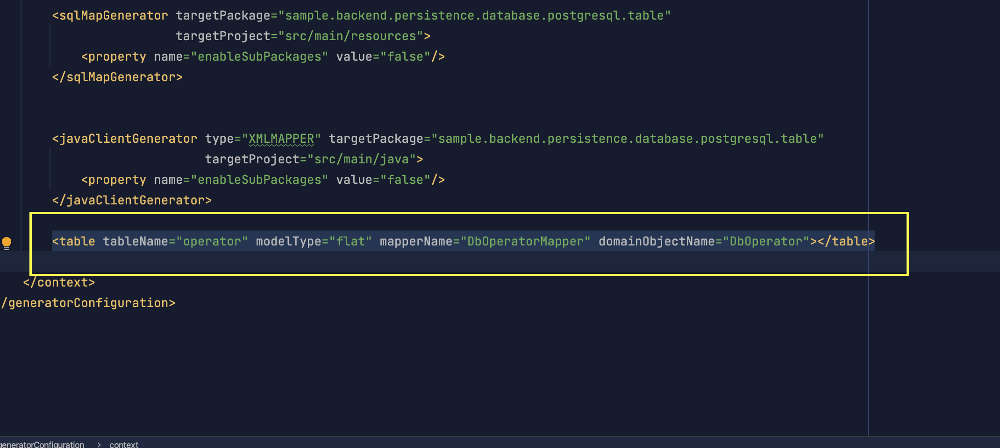
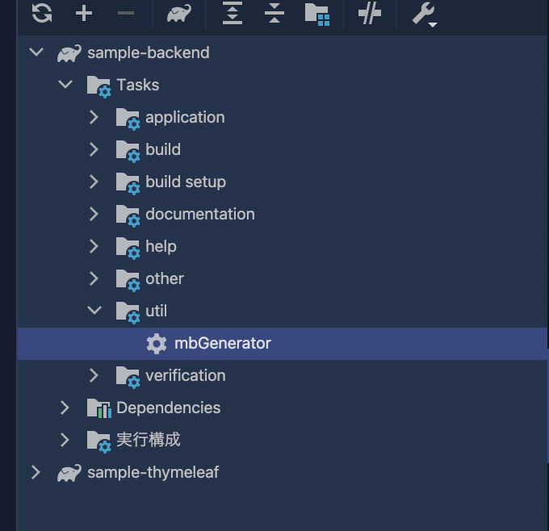
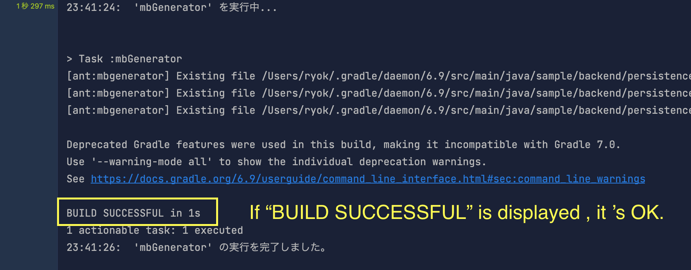
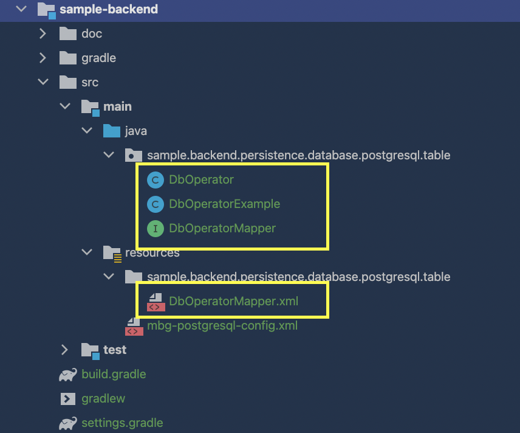

# How to create the table mapper

## 1. Create a Config file.
### Sample 
#### => `sample-backend/src/main/resources/mbg-postgresql-config.xml`

## 2. Add the table using the table-tag.

## 3. Execute the mbGenerator task.

