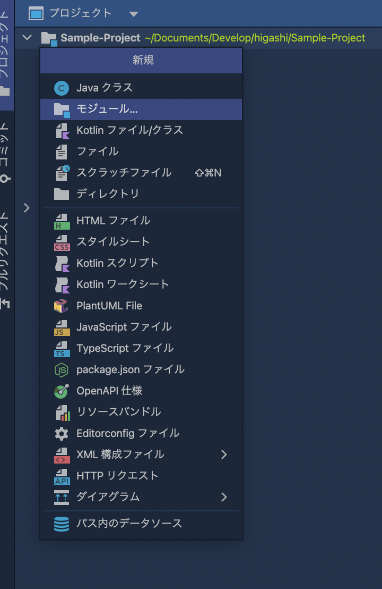
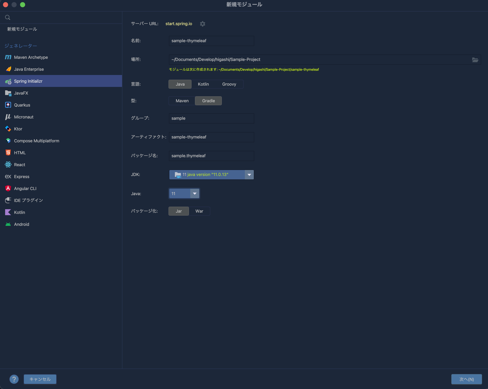
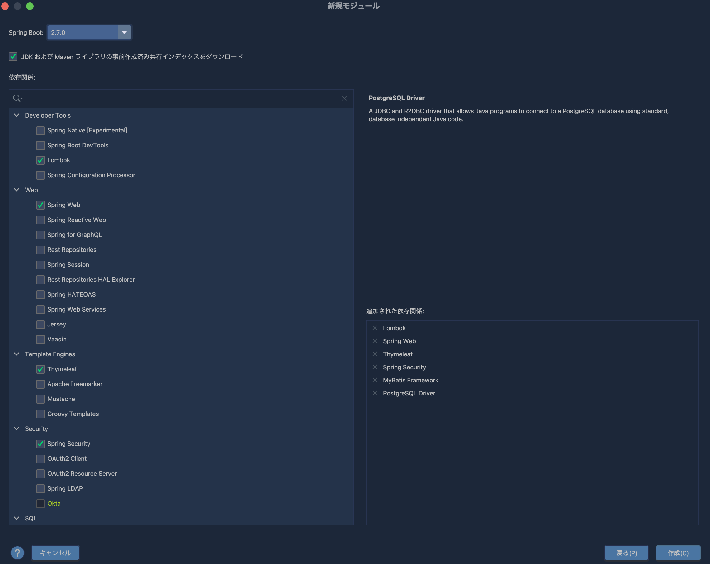
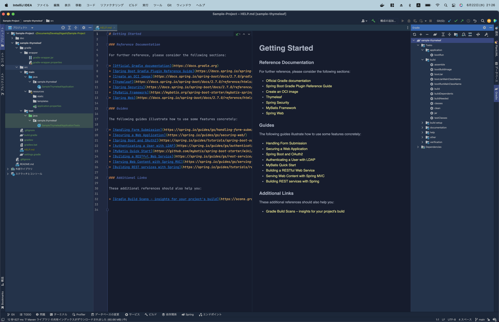

# How to create the new project
#### example "sample-thymeleaf"

## 1. Select "Module".

## 2. Enter the project name and so on.

## 3. Select the required dependency relations.

## 4. The project has been created.

